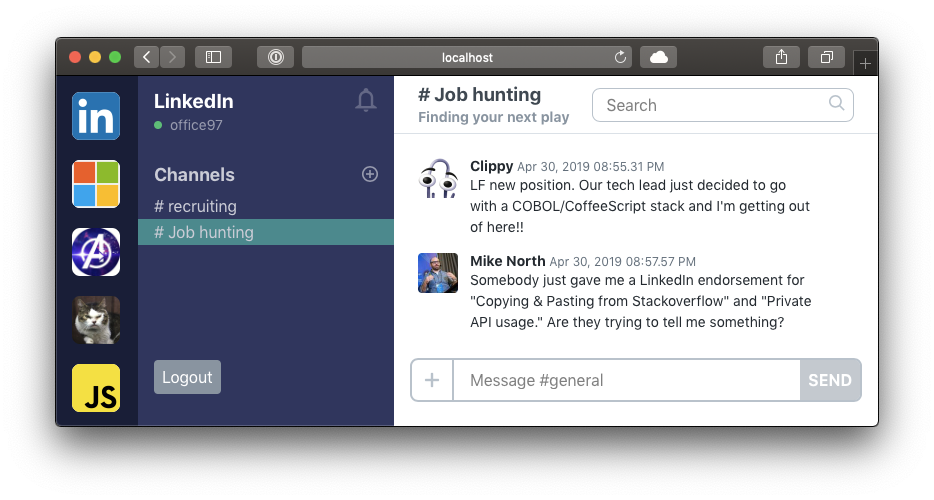

# Ember Octane Essentials

[Ember Octane](https://emberjs.com/editions/octane/) is a version of the popular [Ember.js](https://emberjs.com/) JavaScript [Single-Page App](https://en.wikipedia.org/wiki/Single-page_application) framework, designed for modern productivity and performance.

## What will we do in this course?

In this course, we'll start with raw HTML and CSS, and end up with lightning fast server-rendered [progressive web app](https://developers.google.com/web/progressive-web-apps/).

Along the way, we'll get hands on experience with many of the important aspects of Ember Octane, including:

- Glimmer Components
- Tracked properties
- Native classes and decorators
- Handling events with the `{{on}}` modifier and `@action` decorator
- Thinking in terms of Routes, Services and Components

## Who is this course appropriate for?

This course requires no direct experience working with Ember.js, but a background in building modern Single-Page Apps (SPAs) of some sort (i.e., React, Angular, Vue) will be helpful.

At a minimum, studens should...

- Have significant knowledge and experience working with modern JavaScript (native classes, prototypal inheritance, async/await, let/const declarations, ES2015 modules, rest/spread operators, enhanced object literals, etc...)
- Have experience working with [DOM APIs](https://developer.mozilla.org/en-US/docs/Web/API/Document_Object_Model) -- particularly in areas like [Element](https://developer.mozilla.org/en-US/docs/Web/API/Element), [Event](https://developer.mozilla.org/en-US/docs/Web/API/Event) and [EventTarget](https://developer.mozilla.org/en-US/docs/Web/API/EventTarget)
- Be familiar with the very basics of [handlebars syntax](https://handlebarsjs.com/) (i.e., take a look at their webpage)

## Topics

We'll look at the following topics and concepts, in the context of an Ember Octane app

- **Template-Only Components** - they've changed from "innerHTML" to "outerHTML", and by doing so have greatly expanded the use cases for these stateless components defined by only a handlebars file
  Parameterizing Components with Arguments - they're now (shallow) immutable, namespaced within the component's scope, and easier to spot -- both at the invocation site of a component and within its template
- **Helpers** - still the "go to" way of incorporating functions into Ember apps. Not much has changed in this area, but not much needed to!
- **Routing** - anytime URL-driven state is needed, Ember's routing layer is likely to be involved in the solution. There's a lot of functionality here, but we'll stick to some of the most common routing needs
- **Tests** - after each of the >20 steps required to build our app, we'll make sure to keep our test suite passing. Along the way, we'll end up writing a variety of unit, integration and acceptance tests
- **Tracked Properties and Derived State** - die-hard fans of "this.get" and "this.set" will be disheartened to see that Ember Octane's change tracking system has been dramatically simplified. We'll look closely at how the @tracked decorator is used, and how everything downstream from tracked state can be handled with regular JavaScript
- **Handling Events with `{{on}}`** - the {{on}} modifier allows events to be handled in a more uniform and server-rendering-friendly way. We'll look at the concept of modifiers in general, how this modifier works, and how it can be used in combination with the new {{fn}} helper as a replacement for {{action}}
- **Services** - still the go-to place for sharing state and functionality (now including actions!) horizontally across your app. We'll use an auth service to share a single piece of state (and related stateful functionality) across several components and routes.
- **Component Architecture** - we'll look at how Glimmer Components present opportunities for popular architectural patterns in other parts of the JS ecosystem, and implement an example of the Container and Presentational Components concept that's very popular in the React ecosystem
- **State Changes + Async** - we'll implement two features in our app that involve concurrency and state changes. Anytime these two concepts mix, there's likely to be some significantly complexity
- **Server-Rendering and PWA** - we'll use fastboot to server-render our app, and develop an appreciation for staying within the boundaries of what's possible in either browser JS or Node. Finally we'll install a service worker in our app so it boots up quickly regardless of network conditions, and use our developer tools to measure the performance ramifications of these changes.
- **Editor Tricks and Developer Experience** - we'll use visual studio code for this workshop, and apply some "light type-checking" to our JS files with the typescript compiler.
